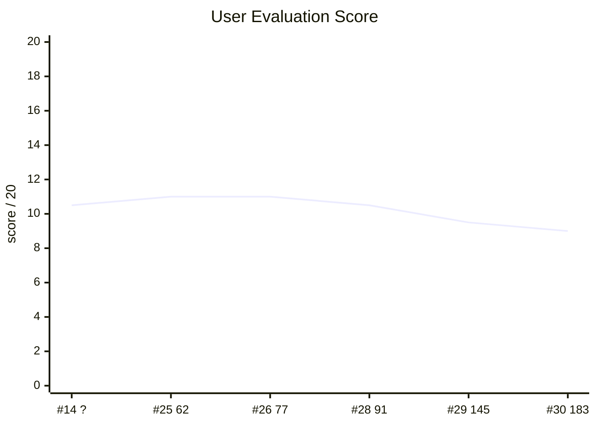
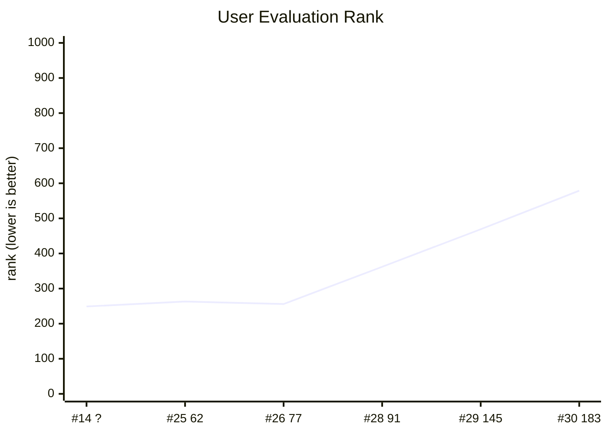
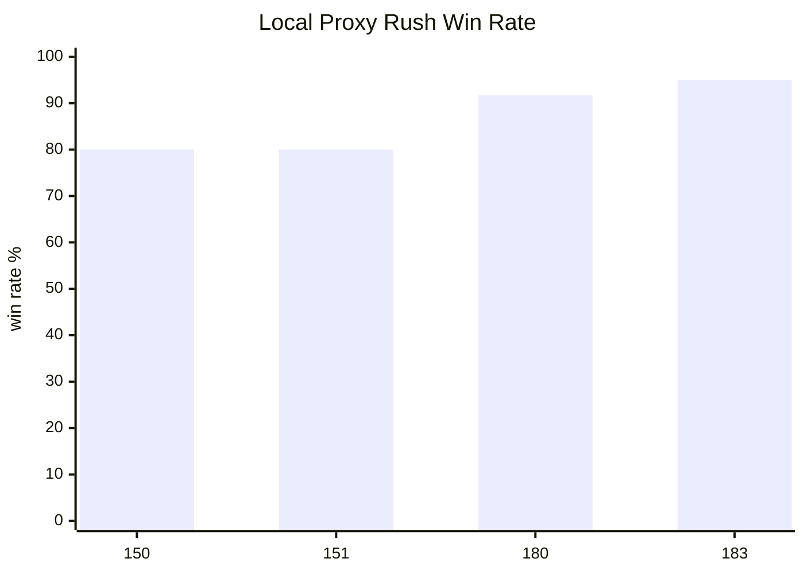

# NYPC Workspace

이 작업 공간은 NYPC 2026 Code Battle 예선 게임 `NEXT NATION`의 봇 개발, 로컬 평가, 서버 로그 분석을 위한 자료를 모아 둔 폴더다.

## 빠른 시작

- 대회와 게임 규칙은 `docs/nypc-overview-rules.md`에서 함께 확인한다.
- 제출 봇과 로그 보관 규칙은 `bots/README.md`와 `docs/bots-organization.md`에서 확인한다.
- 봇 개발 흐름과 전략 기록은 `docs/workflow-strategy.md`를 기준으로 본다.
- 에이전트/기여자 작업 지침은 루트 `AGENTS.md`를 기준으로 본다.
- 원본 문서는 보존되어 있으며, 통합 여부는 `docs/integration-check.md`에 기록했다.

## 결과 대시보드

유저 중간평가는 실제 대회 상대 결과이고, 로컬 봇 상대 결과는 동일하지 않은
실험 묶음이 섞여 있다. 아래 그래프는 전체 흐름을 보기 위한 대표 체크포인트다.







| Eval | Bot | User W-D-L | Score | Tier | Rating | Rank |
| --- | ---: | ---: | ---: | ---: | ---: | ---: |
| #14 | ? | 9-3-8 | 10.5 | 7 | 1750 | 249 / 700 |
| #25 | 62 | 10-2-8 | 11.0 | 9 | 1980 | 263 / 864 |
| #26 | 77 | 10-2-8 | 11.0 | 9 | 1910 | 256 / 876 |
| #28 | 91 | 9-3-8 | 10.5 | 7 | 1880 | 362 / 907 |
| #29 | 145 | 9-1-10 | 9.5 | 9 | 1920 | 469 / 914 |
| #30 | 183 | 8-2-10 | 9.0 | 7 | 1710 | 579 / 937 |

| Bot checkpoint | Local bot-opponent result |
| --- | --- |
| 150 | Proxy rush seed1/41/81: `192W/48L/0D` (`80.0%`). Non-rush proxy mostly stable: econ `201W/6L/33D`, turtle `234W/0L/6D`, punch `240W/0L/0D`. |
| 151 | Same proxy totals as 150; selected because it improved one eval29 replay branch without local regression. |
| 180 | Proxy rush seed1/41/81: `220W/20L/0D` (`91.7%`). Direct vs 77/90 seed1 improved from `4W` to `6W` with no losses. |
| 183 | Proxy smoke seed1+41: rush `76W/4L/0D` (`95.0%`), econ `67W/1L/12D`, turtle `78W/0L/2D`, punch `80W/0L/0D`. Final user eval still regressed, mainly on zero-base fallback and midgame economy preservation. |

Postmortem: `docs/183-user-log-analysis.md` summarizes the final user-log failure modes. The short version is that movement prediction was precise but sparse, while the biggest strategic weaknesses were zero-base fallback, midgame HQ wave defense, and T90-T160 base preservation.

## 폴더 구조

- `bots/`: 활성 제출 봇과 NYPC/유저 로그. 최종 제출 후보는 `183.py`와 `183_data.bin`이었다. `*_nypc_log/`, `*_user_log/`, `archive/`는 보존 데이터다.
- `tools/`: 평가, 리플레이, 로그 분석, 튜닝 스크립트.
- `nation-providing/`: 공식 로컬 테스트 도구, 샘플 코드, 설정 파일.
- `opponents/`: 로컬 평가용 프록시 상대.
- `results/`: 평가 실행 결과. 결론을 문서화한 뒤 정리할 수 있는 일회성 출력이다.
- `docs/`: 통합 문서와 현재 운영 문서.
- `docs/archive/`: 통합 전 원본 문서와 지난 참고 자료.

## 기본 검증

```bash
python3 -m py_compile bots/<n>.py tools/*.py
python3 tools/evaluate_pool.py --bot bots/<n>.py --start 1 --count 5 --side both --pools sample --name <n>-sample-smoke
```

서버 로그나 유저 로그는 다시 얻기 어렵다. 정리 작업 전에 항상 보존 대상을 먼저 확인한다.
