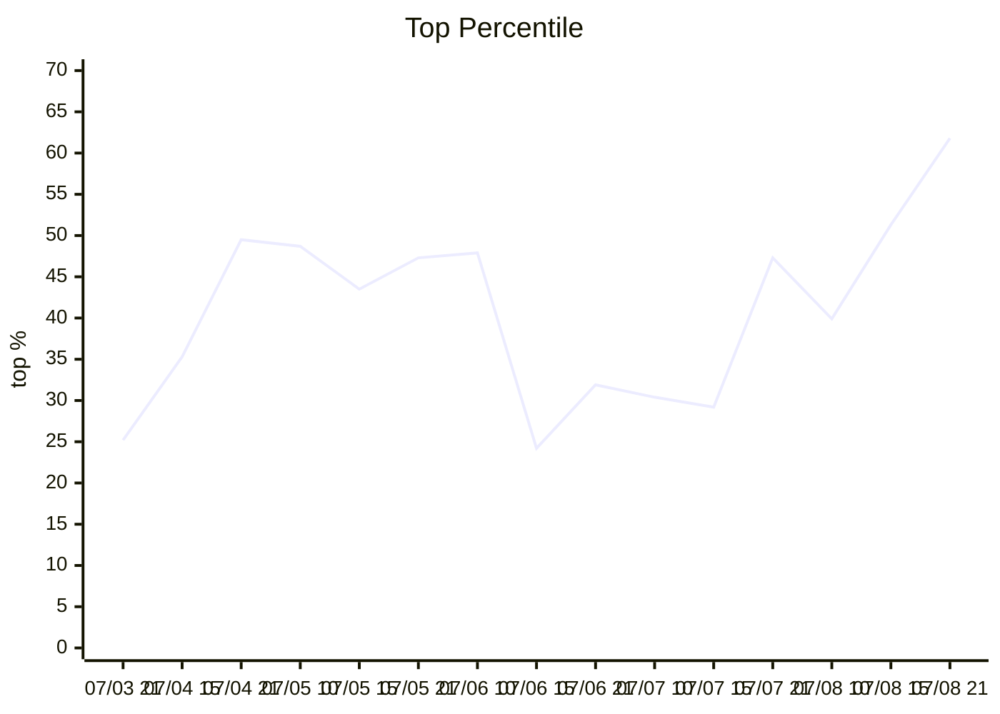
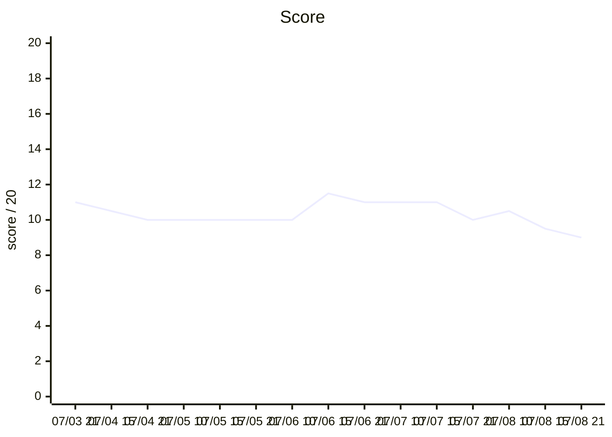
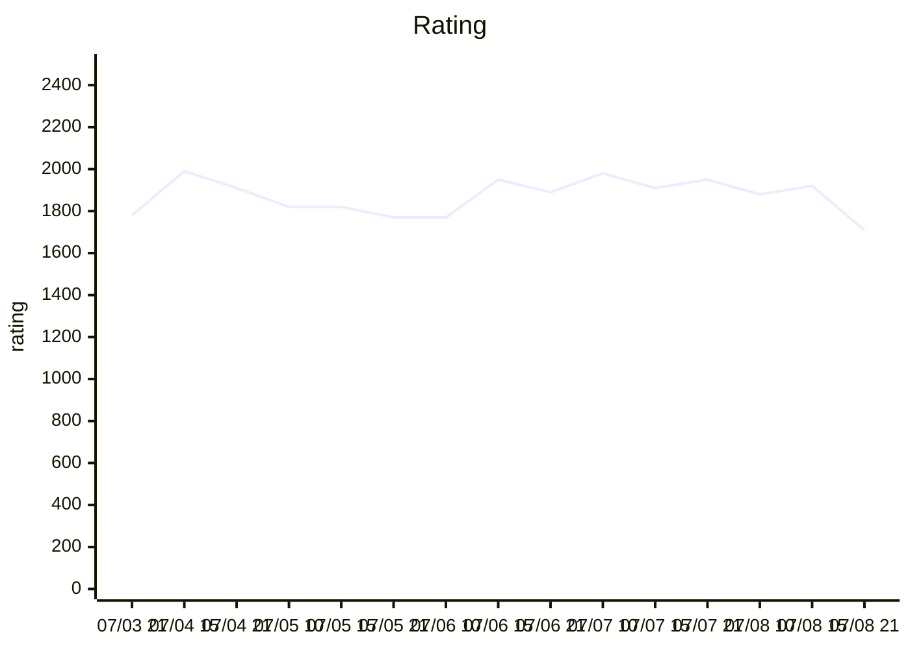
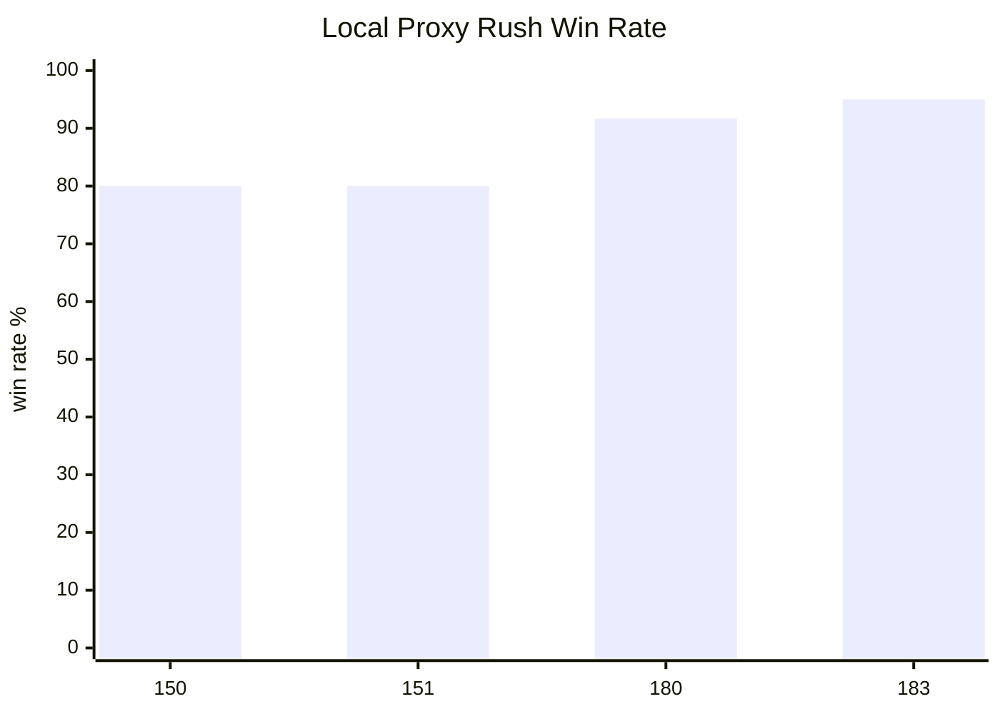

# 2026_nypc

NYPC 2026 Code Battle 예선 게임 `NEXT NATION`을 준비하며 만든 봇 개발
워크스페이스입니다.

- Team: `softkleenex.`
- Final submitted bot: `bots/183.py`
- Final submitted data file: `bots/183_data.bin`

---

## 빠른 시작

- 대회와 게임 규칙은 `docs/nypc-overview-rules.md`에서 확인합니다.
- 제출 봇과 로그 보관 규칙은 `bots/README.md`에 정리했습니다.
- 봇 개발 흐름과 전략 기록은 `docs/workflow-strategy.md`가 기준입니다.
- 에이전트/기여자 작업 지침은 루트 `AGENTS.md`를 기준으로 봅니다.

```bash
python3 -m py_compile bots/<n>.py tools/*.py
python3 tools/evaluate_pool.py --bot bots/<n>.py --start 1 --count 5 --side both --pools sample --name <n>-sample-smoke
```

---

## 문서 지도

- `docs/nypc-overview-rules.md`: 공식 개요와 `NEXT NATION` 규칙 원문 통합본입니다.
- `docs/workflow-strategy.md`: 봇 후보별 실험, 기각 사유, 검증 루프를 남긴 작업 로그입니다.

---

## 유저 상대 평가 그래프

아래 그래프는 보관된 유저 상대 평가 로그 기준입니다. 폴더명은
`bot<번호>_<YYYYMMDD>_<HHMM>_user_log` 형식이며, 로컬 proxy/direct 결과와
일대일로 대응하지 않습니다. Top %는 낮을수록 좋습니다.







| Time | Bot | User W-D-L | Score | Tier | Rating | Rank | Top % | Logs |
| --- | ---: | ---: | ---: | ---: | ---: | ---: | ---: | ---: |
| 07/03 21:00 | 43 | 11-0-9 | 11.0 | 7 | 1780 | 181 / 718 | 25.2% | 20 / 20 |
| 07/04 15:00 | 46 | 9-3-8 | 10.5 | 9 | 1990 | 264 / 747 | 35.3% | 20 / 20 |
| 07/04 21:00 | 46 | 6-8-6 | 10.0 | 9 | 1910 | 377 / 762 | 49.5% | 20 / 20 |
| 07/05 10:00 | 47 | 7-6-7 | 10.0 | 7 | 1820 | 382 / 784 | 48.7% | 20 / 20 |
| 07/05 15:00 | 47 | 9-2-9 | 10.0 | 7 | 1820 | 344 / 790 | 43.5% | 20 / 20 |
| 07/05 21:00 | 47 | 8-4-8 | 10.0 | 7 | 1770 | 380 / 804 | 47.3% | 0 / 20 |
| 07/06 10:00 | 47 | 7-6-7 | 10.0 | 7 | 1770 | 396 / 826 | 47.9% | 20 / 20 |
| 07/06 15:00 | 50 | 10-3-7 | 11.5 | 9 | 1950 | 202 / 833 | 24.2% | 20 / 20 |
| 07/06 21:00 | 55 | 9-4-7 | 11.0 | 7 | 1890 | 270 / 846 | 31.9% | 20 / 20 |
| 07/07 10:00 | 62 | 10-2-8 | 11.0 | 9 | 1980 | 263 / 864 | 30.4% | 20 / 20 |
| 07/07 15:00 | 77 | 10-2-8 | 11.0 | 9 | 1910 | 256 / 876 | 29.2% | 20 / 20 |
| 07/07 21:00 | 91 | 8-4-8 | 10.0 | 9 | 1950 | 420 / 888 | 47.3% | 20 / 20 |
| 07/08 10:00 | 91 | 9-3-8 | 10.5 | 7 | 1880 | 362 / 907 | 39.9% | 20 / 20 |
| 07/08 15:00 | 145 | 9-1-10 | 9.5 | 9 | 1920 | 469 / 914 | 51.3% | 20 / 20 |
| 07/08 21:00 | 183 | 8-2-10 | 9.0 | 7 | 1710 | 579 / 937 | 61.8% | 20 / 20 |

`07/05 21:00`은 랭킹 요약만 남아 있어 match log 원문이 비어 있습니다. 그 외
보관된 평가는 모두 20개 match log를 포함합니다.

---

## 로컬 봇 상대 결과

대표 체크포인트만 요약했습니다. 각 bot마다 평가 범위가 다르므로 같은 표 안에서도
동일 조건 비교가 아닌 행은 설명을 함께 적었습니다.



| Bot checkpoint | Local bot-opponent result |
| --- | --- |
| 150 | Proxy rush seed1/41/81: `192W/48L/0D` (`80.0%`). Non-rush proxy: econ `201W/6L/33D`, turtle `234W/0L/6D`, punch `240W/0L/0D`. |
| 151 | Same proxy totals as 150; selected because it improved one eval29 replay branch without local regression. |
| 180 | Proxy rush seed1/41/81: `220W/20L/0D` (`91.7%`). Direct vs 77/90 seed1 improved from `4W` to `6W` with no added losses. |
| 183 | Proxy smoke seed1+41: rush `76W/4L/0D` (`95.0%`), econ `67W/1L/12D`, turtle `78W/0L/2D`, punch `80W/0L/0D`. Final user eval still regressed. |

---

## 주요 Bot 서명

- 0062 bot: early user-eval baseline. Tier 9 / rating 1980까지 올렸지만, 고티어 상대로 경제와 HQ race 취약점이 남았습니다.
- 0077 bot: 안정 기준선. 이후 후보의 direct sparring 기준으로 오래 사용했습니다.
- 0091 bot: 초반 all-in mass 감지와 desperate race gate가 들어간 안전 후보 계열의 중심입니다.
- 0125 bot: 기지 붕괴 중 안전 재건 reserve 우회로 실제 손실 로그를 처음 크게 건드린 후보입니다.
- 0135 bot: 공식 8번 draw 원인을 제거한 제출 후보입니다.
- 0145 bot: 공식 서버 로그 8승 제출 이후 eval29 유저 로그 분석의 기준점입니다.
- 0150 bot: delayed mass rush latch로 eval29 손실 3개를 replay branch에서 개선했습니다.
- 0151 bot: 초단기 delayed mass 즉시 감지 보강. 로컬 무회귀였지만 user score는 확정 개선으로 이어지지 않았습니다.
- 0180 bot: `data.bin` 기반 target-policy와 RIGHT macro 보정을 묶은 강한 로컬 후보입니다.
- 0183 bot: 최종 제출본. grouped HQ policy data와 T30-T70 근접 압박 요새화 보정이 들어갔지만, 최종 유저 평가에서는 zero-base fallback과 midgame economy preservation 약점이 드러났습니다.

---

## 폴더 구조

- `bots/`: 제출 봇, 선택 `data.bin`, NYPC 공식 로그, 유저 평가 로그입니다. 유저 로그는 `bot<bot>_<YYYYMMDD>_<HHMM>_user_log/` 형식으로 정리합니다.
- `tools/`: 평가, 리플레이, 로그 분석, 튜닝 스크립트입니다.
- `nation-providing/`: 공식 로컬 테스트 도구, 샘플 코드, 설정 파일입니다.
- `opponents/`: 로컬 평가용 프록시 상대입니다.
- `docs/`: 통합 문서, 운영 문서, 전략 작업 기록입니다.
- `results/`: 생성된 평가 결과입니다. Git에는 올리지 않고 결론만 문서화합니다.

---

## Postmortem

최종 `183`의 이동 예측은 precision은 높았지만 sparse했습니다. 마지막 유저 로그에서
더 큰 문제는 다음 세 가지였습니다.

- zero-base / no-expansion fallback 부재
- 중반 HQ 직행 wave에 대한 전용 방어 부족
- T90-T160 base preservation 실패

145 제출 시점의 공식 로그 재생 커버리지는 `30/45/60/61/62/76/77/78/91/125/143/145_nypc_log`
전체 97게임 기준 `145.py` replay `97W/0L/0D`였습니다. 이 수치는 회귀 확인용
스냅샷이며, 적응형 유저 봇 상대 성능을 보장하지 않습니다.
