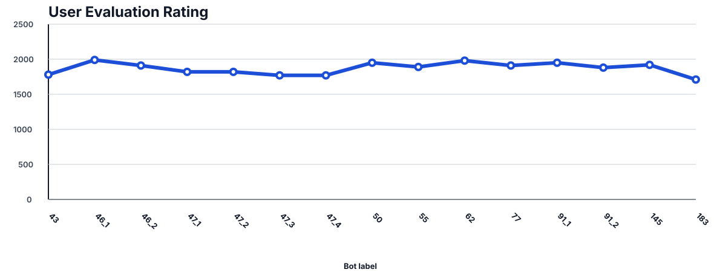
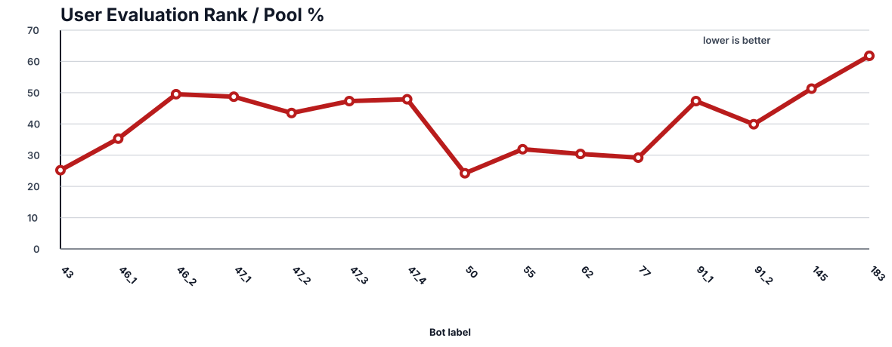

# 2026 NYPC NEXT NATION 회고

## 결과부터 돌아보기

팀 `softkleenex.`의 목표는 유저 상대 평가 100위권 진입이었다. 최종 제출은
`bots/183.py`와 `bots/183_data.bin`이었지만, 마지막 중간평가는 937팀 중
579위, Tier 7, rating 1710으로 끝났다. 20전 성적은 8승 2무 10패였다.
목표에는 크게 못 미쳤고, 마지막 제출은 직전 `145`의 469위보다도 낮았다.

이 결과는 단순히 "전략이 약했다"로 정리하기 어렵다. 로컬에서는 183이 rush
proxy에 76승 4패를 기록했고, 공식 봇 로그 재생도 안정적이었다. 그럼에도 실제
유저전에서는 저레이팅 상대에게도 두 차례 패했다. 이번 대회의 핵심 실패는 봇의
강함보다 **강함을 측정하는 방법을 실제 평가 분포와 맞추지 못한 것**이었다.

## 무엇을 만들었나

NEXT NATION은 그래프 형태의 맵에서 경제, 업그레이드, 병력 생산과 이동을 매 턴
결정하는 전략 게임이다. 봇은 다음 판단을 하나의 규칙 기반 정책으로 묶었다.

- 본부와 기지 업그레이드, 유지비, 훈련비를 함께 보는 경제 큐
- 본부 주변 위협, 침공 지속 시간, 병력 열세에 따른 수비와 회군
- 전방 거점 staging, 적 본부 관문 웨이브, 종반 점수 경쟁
- 초반 all-in과 중간 타이밍 mass rush 감지
- 최단경로와 이동 중인 병력의 도착 시간을 반영한 카운터 레이스
- `data.bin`에 저장한 맵·행동 프로필을 이용한 제한적 상대 의도 추정

후보는 번호를 올릴 때마다 한 가지 가설만 추가하는 방식으로 관리했다. 문법 검사,
샘플 봇, 네 종류 proxy, 이전 강한 봇과의 양 진영 직접 대결, 서버·유저 로그
재생을 통과해야 다음 후보가 되었다. 183개 번호가 모두 독립적인 큰 버전은 아니며,
상당수는 한 조건을 좁히거나 기각하기 위한 실험 스냅샷이다.

## 잘된 접근

가장 유효했던 습관은 패배를 기능 목록이 아니라 인과 가설로 바꾼 일이었다. 예를
들어 기지가 무너진 뒤 300골드가 있어도 유지비 여유분 때문에 재건하지 못하는
문제를 찾았고, 안전한 거점에 한해 즉시 재건하도록 고쳤다. RIGHT 진영에서 내부
번호를 뒤집어 보면서 최단경로 tie-break가 반대로 계산되던 문제도 공식 규칙에
맞췄다. 초반 병력 5기 all-in, 이동 중 병력의 실제 전환 가능 시점, 적 HQ 관문의
유효 웨이브 수처럼 상태 회계가 틀린 부분도 하나씩 바로잡았다.

이 과정에서 "그럴듯한 변경"을 실제로 많이 버렸다. 넓은 회군, 공격 시점 조기화,
저축 해제 같은 후보는 특정 로그를 개선해도 proxy나 직접 대결에서 손실이 늘면
채택하지 않았다. 실험 결과와 기각 사유를 남긴 덕분에 같은 실패를 반복하는 횟수도
줄었다. 공식 8봇에서 145가 8승을 기록하고, 과거 공식 로그 97개를 고정 재생했을
때 모두 승리 분기로 바뀐 것은 규칙 정확성과 회귀 방지 면에서는 분명한 성과였다.

## 가장 큰 판단 오류

### 1. 리플레이 분기를 승리 신호처럼 과대평가했다

고정 리플레이는 상대의 과거 명령을 그대로 재생한다. 우리 명령이 바뀌어 상태가
달라지면 상대의 기록된 명령이 불가능해져 WA가 날 수 있다. 이것은 "패배와 다른
분기를 만들었다"는 증거일 뿐, 적응하는 실제 상대에게 이겼다는 증거가 아니다.
문서에는 이 한계를 계속 적었지만, 제출 직전 의사결정에서는 replay-WA가 만든
개선 건수를 사실상 성능 지표처럼 사용했다.

### 2. 로컬 상대 풀이 실제 유저 다양성을 대표하지 못했다

econ, turtle, rush, punch proxy와 이전 버전 direct sparring은 회귀 감지에는
좋았지만 모두 우리가 정의한 전략 공간 안에 있었다. 그래서 로컬 rush 승률은
80%에서 95%까지 올랐는데도 유저 평가 순위 비율은 마지막에 61.8%로 악화됐다.
같은 계보의 봇끼리 무승부가 많은 직접 대결도 새로운 상대 스타일에 대한 일반화를
보장하지 않았다.

### 3. 검증을 통과한 조건이 너무 많이 누적됐다

한 번에 한 조건만 바꾸는 방식은 회귀 원인을 찾기에는 좋았다. 하지만 채택된 좁은
예외가 계속 쌓이면서 경제, 방어, 공격 래치가 서로 영향을 주는 거대한 규칙망이
되었다. 각 패치는 국소적으로 설명 가능했지만, 전체 정책은 특정 상황에서 어떤
분기가 우선하는지 예측하기 어려워졌다. 후반에는 새 전략을 설계하기보다 기존 조건을
피해 또 다른 조건을 추가하는 시간이 늘었다.

### 4. 구조적 약점을 너무 늦게 다뤘다

맵의 chokepoint와 거점 가치, 다수 병력의 공동 임무 배정, 상대 이동방향 추정은
초기부터 중요하다고 보았지만 제출 위험 때문에 뒤로 미뤘다. `data.bin`도 마지막
단계에 도입되어 일부 고정밀 신호를 제공했지만 실제 명령을 바꾸는 경우가 드물었다.
결국 마지막 봇도 기지 0개 상태의 회복, T90~160 기지 보존, 중반 HQ 직행 웨이브
방어라는 구조적 문제를 해결하지 못했다.

## 마지막 평가가 보여준 것

183은 RIGHT에서 9전 1승 1무 7패로 특히 약했다. LEFT에서도 rating 1490과
820 상대에게 패했고 rating 1110 상대와 비겼다. 강한 상대에게 진 것만으로 설명할
수 없는 결과다. 기지가 사라진 뒤 병력을 경제 복구로 연결하지 못하거나, 상대의
중반 본부 직행을 너무 늦게 방어하고, 유리한 게임을 200턴 판정 전에 끝내지 못하는
패턴이 남았다. 상대 스타일과 진영에 따라 성능 분산이 큰 봇이었다.

145에서 183으로 가는 동안 로컬 지표는 좋아졌지만 실전 점수는 9.5점에서 9.0점으로
내렸다. 두 평가는 상대가 다른 20경기 표본이므로 이것만으로 183이 본질적으로 더
약하다고 단정할 수는 없다. 그러나 "183은 145의 확실한 개선판"이라는 결론에도
근거가 없었다. 정확한 표현은 "선택한 로컬 시험에서는 좁게 개선됐지만, 실제 유저
분포에서는 검증되지 않았고 마지막 표본에서는 오히려 악화된 후보"다.

## 다시 한다면

1. 초기에 전략 계열이 다른 상대 풀을 만들고, 일부 seed와 상대는 끝까지 보지 않는
   holdout으로 고정한다.
2. 리플레이 WA는 승리가 아니라 `diverged`로만 집계하고, 정상 종료한 재대결만
   성능 비교에 사용한다.
3. 전체 승률 외에 진영, 맵 크기, chokepoint, 상대 확장 속도, 첫 공격 시점별
   성능을 별도로 본다.
4. 규칙 예외를 더하기 전에 경제·방어·공격을 명시적인 모드와 우선순위로 분리하고,
   다수 병력을 임무 단위로 배정한다.
5. `data.bin`은 마지막 보강이 아니라 초기에 맵 프로필과 검증된 통계만 담는
   재현 가능한 산출물로 설계한다.
6. 제출 직전에는 새 기능을 넣지 않고, 최소 두 번의 유저 평가에서 개선이 반복된
   후보만 대표로 올린다.

## 남은 성과

순위 목표는 달성하지 못했지만, 대회 규칙을 실행 가능한 모델로 옮기고 300개의 유저
match log와 공식 로그를 정형화했으며, 가설-변경-검증-기각의 기록을 남겼다. 무엇보다
"로컬에서 강하다"와 "평가 분포에서 강하다"는 전혀 다른 주장임을 수치로 확인했다.
다음 전략 게임에서는 더 많은 휴리스틱보다 먼저 평가 설계와 상대 다양성부터 만들
것이다. 이번 실패에서 가장 오래 가져갈 결론이다.

## 자료 안내

- 전체 결과와 그래프: [`README.md`](README.md)
- 봇·로그 저장 규칙: [`bots/README.md`](bots/README.md)
- 실험 및 기각 기록: [`docs/workflow-strategy.md`](docs/workflow-strategy.md)
- 공식 개요와 게임 규칙: [`docs/nypc-overview-rules.md`](docs/nypc-overview-rules.md)
